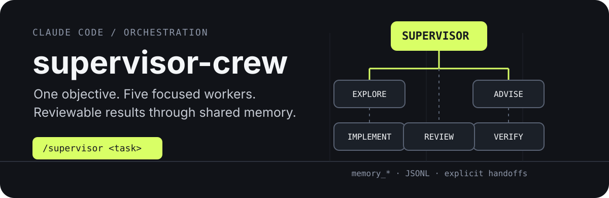
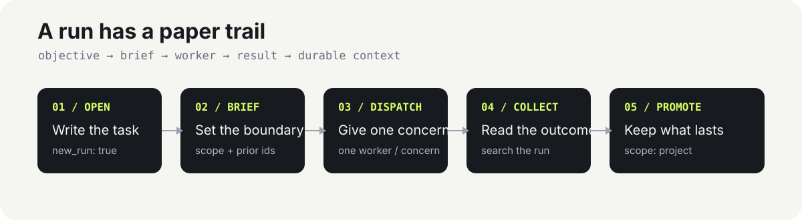

# supervisor-crew

<p align="center">
  
</p>

> A Claude Code plugin that turns one objective into a supervised, reviewable crew run.

## Start here

Install the plugin with Claude Code, or point Claude Code at this directory:

```text
/plugin install ./plugins/supervisor-crew
```

Then start a run from the main thread:

```text
/supervisor <describe the objective>
```

The supervisor owns the plan, dispatches only the workers needed for the task, and synthesizes their results. It does not read or edit the codebase itself.

## What the crew does

<p align="center">
  
</p>

| Role | Job | Boundaries |
| --- | --- | --- |
| `repository-explorer` | Map files, symbols, and data flow | Read-only; no shell or edits |
| `advisor` | Compare approaches and recommend one | Read-only; does not implement |
| `implementer` | Make the scoped change | The only worker with write access |
| `reviewer` | Inspect the diff for scope and correctness | Read-only; never fixes findings |
| `verifier` | Run the project's checks and report real output | Read-only; cannot alter results |

The supervisor dispatches one worker per concern. Workers never coordinate directly: the shared memory server is the durable channel between them.

## Why it is different

The plugin makes orchestration explicit instead of treating subagents as an opaque parallel button:

- **Scoped responsibility.** Exploration, design advice, implementation, review, and verification have separate prompts and tool boundaries.
- **Durable handoffs.** Each dispatch gets a memory brief with its scope, prior findings, and expected answer shape.
- **Review before confidence.** The workflow separates “the change was written” from “the change was inspected” and “the checks passed.”
- **Project memory.** Run-scoped JSONL is disposable; project-scoped memory can be committed as shared context.

## Memory server

The plugin registers a dependency-free Node.js MCP server named `memory`. It exposes:

```text
memory_write    create tasks, handoffs, findings, and decisions
memory_search   find run or project entries
memory_read     retrieve one entry by id
memory_forget   retire an entry that is no longer true
```

Storage is append-only JSONL under the project where Claude Code is running:

```text
.claude/memory/runs/       run-scoped entries
.claude/memory/project.jsonl  durable project knowledge
```

Commit `project.jsonl` when it contains conventions or decisions the team should keep. Run memory is disposable.

## Claude Code port notes

This plugin is self-contained and has zero npm dependencies. It ports the `supervisor-oc-plugin` workflow to Claude Code with two deliberate differences:

1. The supervisor is a `/supervisor` slash command that drives the main thread. Claude Code does not expose the opencode-style primary-agent override.
2. Per-command Bash allow/ask/deny rules are represented in agent prompts. Use `.claude/settings.json` if you need hard permission gates.

Worker provenance is explicit: every subagent is instructed to pass its own name as the `agent` argument to `memory_*` calls.

## Plugin layout

```text
supervisor-crew/
├── .claude-plugin/plugin.json       manifest and memory MCP registration
├── commands/supervisor.md            /supervisor orchestration protocol
├── agents/                           five scoped worker prompts
└── mcp-server/memory-server.js       dependency-free JSONL memory server
```

## License

No license file is currently included in this plugin directory.
